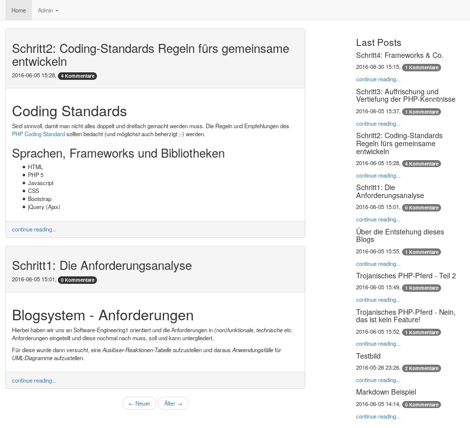

IT1-Beleg 2016
==============

Entwicklung einer einfachen Blog-Engine als serverbasierte mobile responsive Webanwendung.

Die Aufgabenstellung ist in Zweier-Teams unter Verwendung von HTML, PHP 5, Javascript, CSS und Ajax zu lösen. Die Nutzung von vorgefertigten Blog-Lösungen und -Templates ist nicht gestattet. Blogposts sollen von allen Besuchern des Blog gelesen aber nur vom Administrator erstellt werden können.

