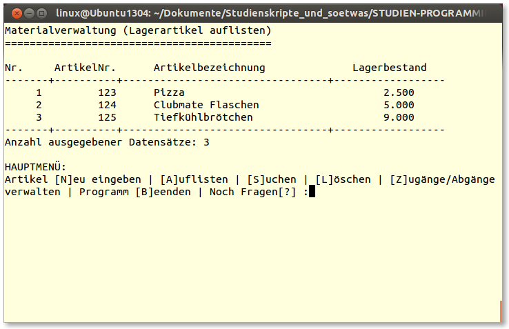

Belegarbeit Programmieren1, Aufgabe 2: Materialverwaltung bei Herrn Prof. Beck im Studiengang Informatik an der HTW Dresden im WS 2013/14
-----------------------------------------------------------------------------------------------------------------------------------------

**Autor:** Name: N. Schwirz

**Version:** 0.1.1

**Homepage:**: https://github.com/Nos-/Studium/tree/master/Beleg-Programmieren1

Aufgabenstellung
----------------

Es werden 4 Belegaufgaben (Aufgabe 1-4) ausgegeben. Die von Ihnen zu lösende Aufgabe ergibt sich aus Matrikelnummer modulo 4 plus 1.

###Hinweise zur Lösung:###

Alle Aufgaben enthalten die Programmierung eines C-Programmoduls, der eine *doppelt verkettete Liste* bereitstellt. Die Funktionalität dieses Listmoduls soll durch das Headerfile list.h beschrieben sein. Das in list.h vorgegebene Interface ist verbindlich, lediglich die Datentypen *tCnct* und *tList* sind eigenständig zu erarbeiten.
i
Die Daten sind in einer Datei zu speichern und programmintern durch die doppelt verkettete Liste zu verwalten. Haben sich die Daten beim Programmlauf verändert, so sind sie beim Verlassen des Programms zu speichern. Das Programm erlaube in jedem Fall das Erfassen, Löschen, Suchen und Anzeigen der Datensätze, sowie eine sortierte tabellarische Auflistung der Daten.

Die Quelltexte sind sorgsam zu kommentieren. Dazu gehört auch die Urheberschaft im Kopf der Quelltexte.

Für alle verwalteten Daten sind Speicherbereiche in der erfordelichen Größe per *malloc* / *free* bereitzustellen

Das Programm bestehe mindestens aus 3 C-Modulen bestehend aus c- und Headerfile. Dabei realisiere ein Modul die Liste, ein Modul die Benutzerschnittstelle (Menus, Eingabemasken, Anzeige ...) und das dritte Modul die oberflächenunabhängigen Teile, z.B. Dateiarbeit. Die Module sollen einzeln compilierbar sein.

Sofern das Programm keine plattformabhängigen Oberflächenbibliotheken, wie *libforms*, *gtk* oder *ncurses* verwendet, soll das Programm portabel sein und sowohl unter *Windows* als auch unter *Linux/Unix* übersetzt und ausgeführt werden können. In jedem Fall müssen die Programme auf den Rechnern in den Laboren der Fakultät vorgeführt und übersetzt werden können.

###Belegaufgabe 2###

Programmieren Sie eine Materialverwaltung.

Das Programm soll Datensätze, die Artikelbezeichnung, Artikelnummer und Lagerbestand speichern, verwalten. Der Lagerbestand soll dabei über einen gesonderten Menuepunkt "Zugang/Abgang" gesondert veränderbar sein.

Lösungsansatz und Umsetzung
---------------------------

Die gestellte Aufgabe, eine Materialverwaltung mit *Doppelt verketteter Liste* in C zu programmieren, löste ich mit der vorliegenden Konsolenanwendung. Ich programmierte unter GNU/ Linux und legte großen Wert auf Portabilität. Der vorliegende Quellcode meines Programmes sollte sich somit (zumindest mit Gcc) auch für andere Betriebssysteme kompilieren und ausführen lassen.

###Kompilier- und Installationsanleitung###

1. Kompilieren: `make {linux|windows}` (einen Überblick über alle Kompilierziele gibt: `make help` und `make all` baut sie alle!) Alternativ kann auch per `gcc *.c -o Materialverwaltung -D{LINUX|WINDOWS}` (vom Programmverzeichnis aus) selbst kompiliert werden.
2. Dokumentation (neu)generieren: `make doku` (Alternativ kann auch die Datei: Readme.txt.md einen Überblick geben.)
3. Ausführen: `Materialverwaltung_xx` (xx steht hier für das Kürzel ihres Betriebssystems etc.)

Unter dem Betriebssystem *Windows* wird zum Kompilieren eine [Cygwin-Umgebung](http://www.cygwin.com/) (siehe auch den [Wikipediaartikel zu Cygwin](http://de.wikipedia.org/wiki/Cygwin)) empfohlen, die zuvor installiert werden sollte.

###Quellenangabe###

* Der Quellcode des Programms: ist von mir selbst geschrieben, ggf. in Anlehung an Studienmitschriften und Praktikumsaufgaben.
* Den Bildschirmschnappschuss des Programmes und die schamatische Darstellung der Datenstruktur erstellte ich selbst
* Das für die Dokumentation verwendete Logo wurde von mir von Wikipedia-Commons (http://commons.wikimedia.org/wiki/File:Bochs.png) herutergeladen. Es stammt von der OpenSource-Software *Bochs* (http://bochs.sourceforge.net/) und steht unter der GNU General Public License, einer Lizenz, die die Weiterverwendung ausdrücklich erlaubt.
