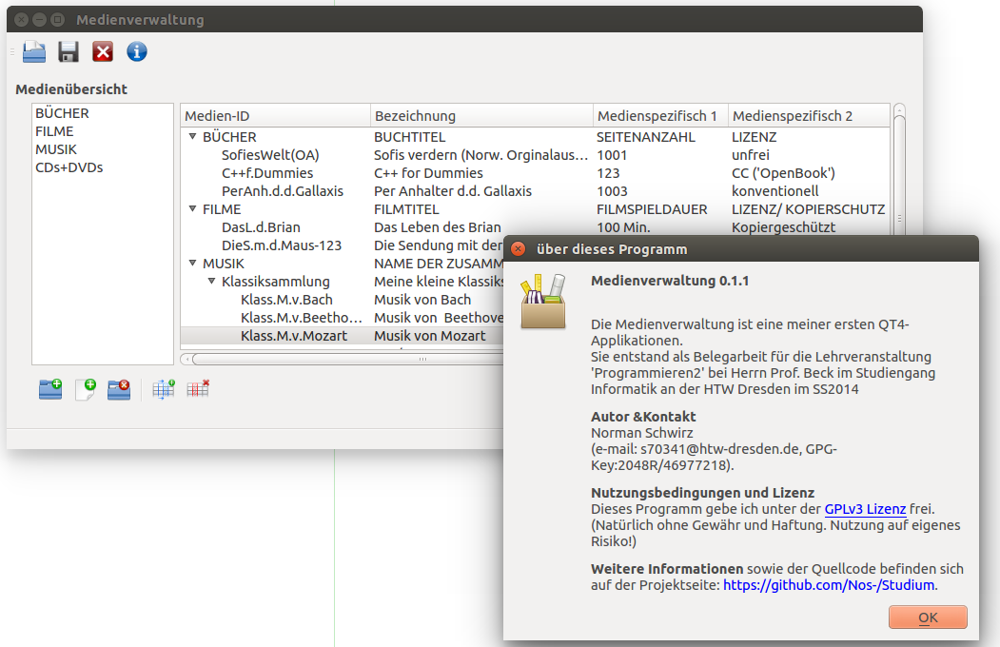

Belegarbeit Programmieren2, Medienverwaltung: bei Herrn Prof. Beck im Studiengang Informatik an der HTW Dresden im SS 2014
--------------------------------------------------------------------------------------------------------------------------

**Autor:** Name: N. Schwirz (e-mail: s70341@htw-dresden.de, GPG-Key:2048R/46977218)

**Version:** 0.1.1

Nutzungsbedingungen und Lizenz
Dieses Programm gebe ich unter der GPLv3 Lizenz frei. (Natürlich ohne Gewähr und Haftung. Nutzung auf eigenes Risiko!)
Weitere Informationen sowie der Quellcode befinden sich auf der Projektseite: https://github.com/Nos-/Studium.
